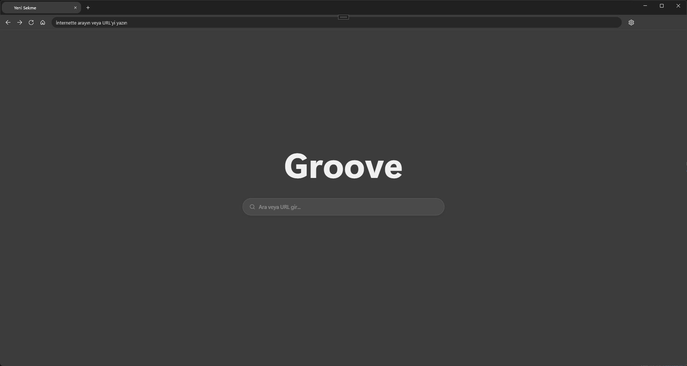

# View the current inventory here: [Groove-v2](https://github.com/firatmio/groove-v2)


# Groove

> *"The web, as it was meant to be."*

[](https://www.gnu.org/licenses/gpl-3.0)
[]()
[]()
[]()

---

## Why Groove?

The web was built by developers. Millions of hours. Millions of pages.

Then came the platforms — and slowly, quietly, that work became their product. Your search results became their inventory. Your content became their training data. Your contribution became someone else's AI. **And you were never asked.**

Groove is not a product. It is a collective decision.

A browser — and eventually a search engine — built entirely in the open, governed by its contributors, owned by no one. We are not here to disrupt Big Tech. **We are here to ignore it.**


## Contributing

Groove grows with every contributor. Whether you write Rust, TypeScript, Go — or you simply care about an open web — there is a branch for you.

Read [CONTRIBUTING.md](./CONTRIBUTING.md) to get started.  
Major changes go through the [RFC process](./rfcs/README.md) — open proposals, open discussion, open decisions.

```bash
git clone https://github.com/firatmio/groove-v2
cd groove-v2
```

---

## Gallery


</br>

> *In app screenshot.*

---

## License

Groove is free software, distributed under the [GNU General Public License v3.0](./LICENSE).

Any software that uses Groove's code must also remain open source. That is not a restriction. That is the point.

---

<p align="center">
  <sub>Built in the open · Owned by no one · <a href="https://gitlab.com/firatmio/groove">gitlab.com/firatmio/groove</a> · <a href="https://github.com/firatmio/groove">github.com/firatmio/groove</a></sub>
</p>
